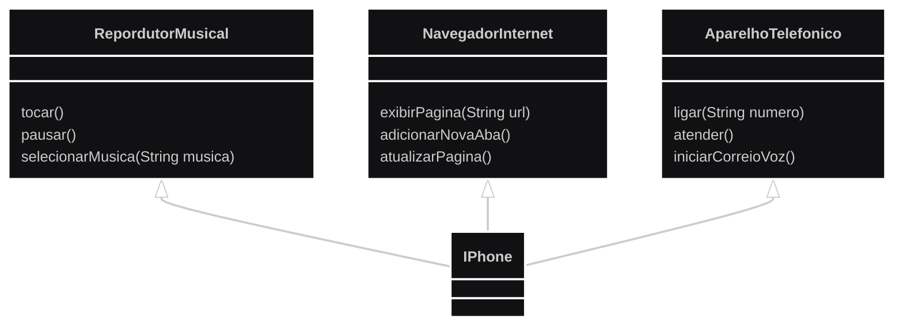

```mermaid
---
config:
  theme: redux-dark
---
classDiagram
direction TB
    class IPhone {
    }
    class RepordutorMusical {
	    tocar()
	    pausar()
	    selecionarMusica(String musica)
    }
    class NavegadorInternet {
	    exibirPagina(String url)
	    adicionarNovaAba()
	    atualizarPagina()
    }
    class AparelhoTelefonico {
	    ligar(String numero)
	    atender()
	    iniciarCorreioVoz()
    }
    RepordutorMusical <|-- IPhone
    NavegadorInternet <|-- IPhone
    AparelhoTelefonico <|-- IPhone
```
